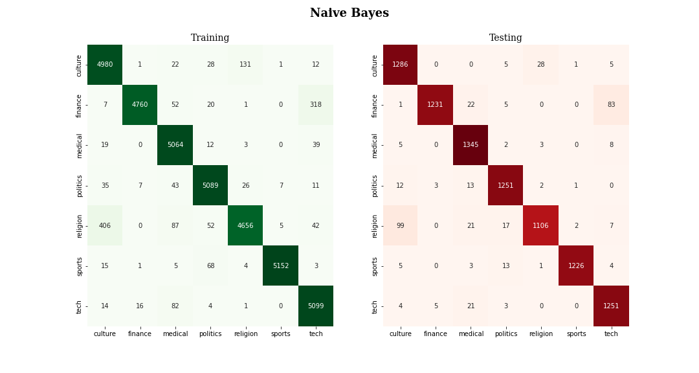
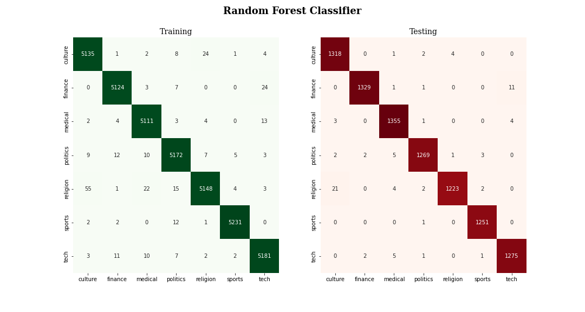

# Classification of Arabic News Articles
> Ian Sharff

## Table of Contents
  - [Table of Contents](#table-of-contents)
  - [Overview](#overview)
  - [Business Understanding](#business-understanding)
  - [Data Understanding](#data-understanding)
  - [Data Preparation](#data-preparation)
  - [Model Training and Evaluation](#model-training-and-evaluation)
  - [Conclusions and Future Work](#conclusions-and-future-work)
  
## Overview
The purpose of this project is to develop a classification model for news articles written in Arabic to be used by educators and their students. The models are trained on a corpus consisting of roughly 200,000 articles written in Modern Standard Arabic (العربية الفصحى), which were obtained from <a href="https://www.sciencedirect.com/science/article/pii/S2352340919304305?via%3Dihub">SANAD project (Single-label Arabic News Articles Dataset)</a>, and as of now the models have been trained on a subset of 7 categories with 6,500 articles. The highest performing model has been a Random Forest Classifier, but Multinomial Naive Bayes, Gradient Boosting, and Support Vector classifiers were also built and tested, each obtaining a testing score above 95% on the subset. The purpose, rationale, and goals of the project are outlined below, and the code behind the models can be found in the [modeling)

## Business Understanding
Arabic is one of the <a href="https://blog.ititranslates.com/2020/09/22/is-arabic-the-richest-language-in-words/">richest languages in the world</a>, meaning that it has a much larger vocabulary than English and is based upon a complex but logical grammar system. Additionally, "Arabic" in and of itself is not a single language; rather, it consists of many variations which are not always mutually intelligible between speakers of different dialects. For this reason, the development of Arabic NLP models can be a daunting task when compared to one in the English language, not to mention the higher quantity of libraries, pretrained models, and other resources available in English. <a href="https://effectivelanguagelearning.com/language-guide/language-difficulty/">Some sources</a> claim that Arabic is one of the hardest languages for native speakers of English to learn, requiring an estimated 2,200 hours of practice and speaking for the average anglophone to obtain fluency. In light of this, many students of Arabic (myself included) often struggle to build what may seem to be a never ending vocabulary. What this project aims to accomplish is to create a the basis of a classification model that can take a corpus of arbitrary size and label its articles with predefined categories to facilitate the learning of genre-specific vocabulary. This tool will ideally be readily deployed as an application to help Arabic educators provide intermediate- to advanced-level reading resources for their students according to their interests.

## Data Understanding
The total corpus from SANAD consists of 194,797 articles written in Modern Standard Arabic, belonging to 7 categories:
* Culture - الثقافة
* Finance - التمويل
* Medical - الطب والصحة
* Politics - السياسة
* Religion - الدين
* Sports - الرياضة
* Technology - العلوم والتكنولوجيا

As such, this is a multiclass classification problem, so class imbalances will need to be taken into account when evaluating models and improving performance. The subset of SANAD articles consist of 6,500 articles per category from the full corpus, which was available online via <a href="https://www.kaggle.com/haithemhermessi/sanad-dataset">Haithem Hermessi's Kaggle dataset</a>. The model will be eventually be trained on the full corpus, containing a mixture of articles from Akhbarona, Arabiya, and Khaleej news websites that were obtained through web-scraping. In total, the class counts are as follows, and the class breakdown by source can be better understood by reading the [class_counts.txt](class_counts.txt) file.

To improve data quality, the `camel_tools` library engineered by the CAMeL lab at NYU Abu Dhabi for Arabic NLP research can be used to greatly reduce the morphological complexity of the corpus vocabulary, given that Arabic syntax requires ligatures for most particles, pronouns, and prepositions. For example, in English, the words "the book" consist of two words but in Arabic they are written as one: الكتاب. Using the Morphological Database available from `camel_tools` is well-suited for this, but the computational complexity of the vectorization will greatly increase.

## Data Preparation
The data were prepared using `sklearn` and `pandas` modules for ease of visualization and model training. The subset corpus was count-vectorized keeping the 10,000 most common words which were then split into training and testing sets. As of now, the Morphological Database from `camel_tools` has not been implemented, but doing so will likely improve model performance and quality. However, the models have all achieved over 95% accuracy on the subset of articles, which is a promising result.

## Model Training and Evaluation
The models constructed and their testing accuracies are as follows in order of computational complexity:
* Naive Bayes: 95.6%
* Random Forest: 99.1%
* Gradient Boosting: 0.97%
* Support Vector: 0.98%

While the Random Forest classifier has performed much better than the others, the Naive Bayes model takes significantly less time to train and is promising due to its compatibility with incremental learning, which would be much more suitable for the filesystem employed in this project. The Naive Bayes and Random Forest confusion matrices are shown below.

## Conclusions and Future Work
The results of this project suggest that a Random Forest Classifier would be highly accurate if trained on the full corpus, but the Naive Bayes model also is promising due to its simplicity. Naive Bayes has historically proven to be very effective with document classification tasks, so this is definitely an area of the project that can be further developed. Other areas to develop are:
* Using word embeddings to train a neural network model, implemented in `keras`/`tensorflow`/`gensim`
* Incorporating a morphological database from `camel_tools` to reduce redundancy in corpus vocabulary.
* Deploying the model as an interactive application, possibly with Docker or Streamlit
* Carefully tuning hyperparameters to improve model performance.